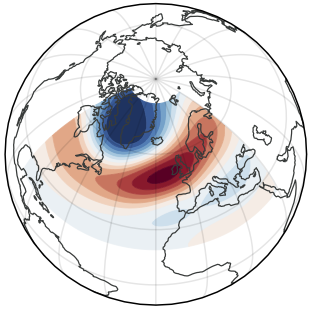

<p align="center">
  
</p>

## 1. Introduction
This repository contains the code for the project "More extreme summertime North Atlantic Oscillation (NAO) under climate change". 

## 2. System Requirements
The code has been test on Linux system. 
`enviroment.yml` provides a list of python dependences. 
an environment can be created by following code:
```bash
conda env create -f environment.yml
conda activate Tel_MMLE
```

## 3. Data
All data used in this study are publicly available. The large ensembles are available at the [MMLE Archive](https://www.cesm.ucar.edu/community-projects/mmlea). The NOAA-CIRES-DOE 20th Century Reanalysis (20CR) data are aviailable at the [NOAA Physical Sciences Laboratory](https://psl.noaa.gov/data/20thC_Rean/). 
In order to use more high-level class objects defined in this project (such as those defined in `/work/mh0033/m300883/Tel_MMLE/src/MMLE_TEL/index_generator.py`), the data should be put under `data` directory, and the directory structure should be like:
```
├── CanESM2             # first level is the name for the model / reanalysis
├── CESM1_CAM5
├── CR20
├── CR20_allens
├── ERA5
├── ERA5_allens
├── GFDL_CM3
├── MK36
├── MPI_GE
├── MPI_GE_onepct
│   ├── codes           # second level contains the pre-processing codes \n
│   ├── composite       # some results such as composite analysis
│   ├── EOF_result      # EOF analysis results
│   ├── zg              # variables such as 'zg', 'ts'
│   ├── zg_Aug          # also variables that are separated by months
│   ├── zg_Jul
│   ├── zg_Jun
│   ├── ts  
└── zodes_for_all       # some pre-processing codes that apply to all models
```
Note that the data need to be pre-processed before calculations. Some pre-process codes can be found in `zodes_for_all`. However, I recommend you to request an example data from me (the data size is too big for GitHub) so that the pre-process history can be found using `cdo showattribute`. 

## 4. Code structure
The project is mainly written in python. Some of the pre-processing and post-processing are in bash.

The codes include `script`, `src` and `test` directories. The `script` directory contains the main scripts for the calculations and ploting, which import some of the functions and class from the `src` directory. The `src` contains the more basic level calculations. The code structure is as follows:
```
├── script
│   ├── calculations_paper            # main calculations for the paper
│   │   ├── 1generate_index           # generate the NAO index for LEs, reanalysis, and resample the MPI_GE (100) to smaller ensemble sizes.
│   │   ├── 2extreme_count            # count the extreme events for each model, reanalysis, and resampled ensemble size
│   │   ├── 3composite_analysis       # composite analysis of surface temperature during the extreme NAO events
│   │   ├── 4project_index            # project the geopotential height field onto the NAO spatial pattern for the projected index       
│   │   └── 5statistical_cal          # some statistical calculations such as calculate slope. 
│   ├── plots_paper 
│   │   ├── main_paper.py             # to generate the plots in main text of the paper
│   │   └── supplementary_paper.py    # to generate the plots in supplementary material of the paper
│   └── _explore_script               # some scripts that may be useful for exploring the data
├── src
│   ├── composite                     # The major package for the composite analysis
│   ├── compute
│   ├── EVT
│   ├── extreme                       # The major package for the extreme event counts
│   ├── html
│   ├── __init__.py
│   ├── MMLE_TEL                      # the major package for NAO index generate and statistical analysis
│   ├── obs
│   ├── plots                         # source code for ploting
│   ├── quick_plot
│   ├── reanalysis
│   ├── Teleconnection                # source code for decomposing the NAO pattern
│   └── warming_stage
```
`test` directory contains test codes for some basic functions in `src` directory, with (simulated) mini dataset.

## 5. How to start
You can easily copy the code to your local machine / HPC by running the following command:
```bash
git clone https://github.com/liuquan18/Tel_MMLE.git
cd Tel_MMLE
```
To repeat the calculation, I strongly recommend using the same conda environment as me. The environment file is provided in the repository, and an environment can be created by following code:
```bash
conda env create -f environment.yml
conda activate Tel_MMLE
```
To make the codes in `scr` directory as importable modules, you need to run the following command:
```bash
python3 -m pip install -e .
```
Then you can run the scripts in the `script` directory to repeat the calculations and generate the plots.

## 6. Demo
The analysis follows "index_generate" --> "extreme_count" --> "composite". For model = 'MPI_GE', a quick calculation could be:

1. For "index_generate": go to file `script/calculations_paper/1generate_index/1MMLE_index_generator.py`, a function called `index_gene(model)` can be used to generate index for one model (at specific plev). And `script/calculations_paper/1generate_index/1MMLE_index_generator_submitter.sh` can be used to generate index parallelly for all models using mpi4py. 

2. For "extreme count": in file `script/calculations_paper/2extreme_count/1MMLE_extreme_count.py`, a function called `extreme_count(model)` can be used to count extreme events for one model (at specific plev).

3. For "composite analysis": in file `script/calculations_paper/3composite_analysis/1MMLE_composite_analysis.py`, a function called `composite` can be used to do composite analysis.

The "index_generate" would take relatively long time, depending on the size of years and ensemble members that used (e.g, 10 years and 100 ensemble members for MPI_GE would take more than half an hour). The "extreme count" can be finished instantly. "composite analysis" would also take very long time to finish.
